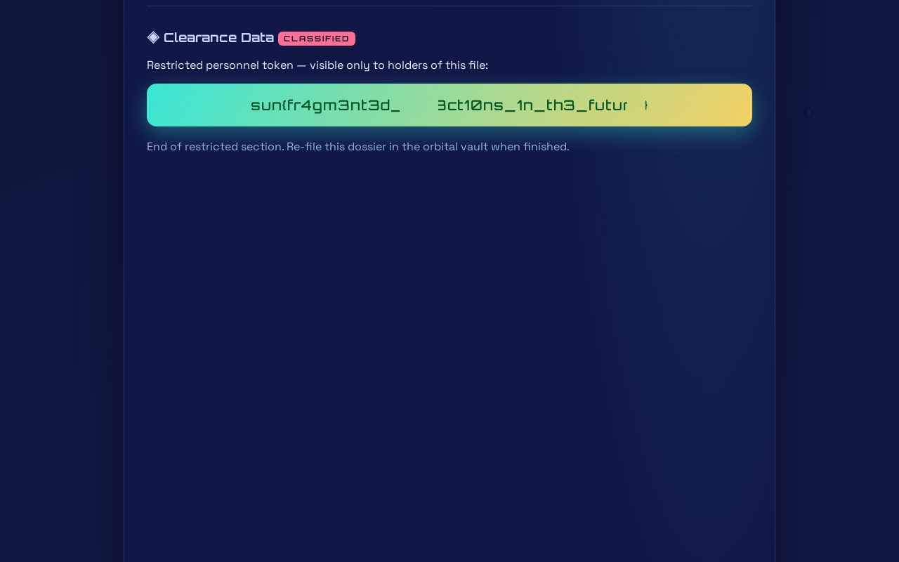

# SiteCheck - SSRF allow-list bypass via IPv6 loopback

- **Platform:** SunshineCTF 2026
- **Category:** Web
- **Difficulty:** 500 points (dynamic, ~487 at the end), 105 solves
- **Date:** 2026
- **Author:** `geo`
- **Link:** `<challenge-url>` (challenge instance, closed after the event)
- **Flag:** `sun{fr4gm3nt3d_r3fl3ct10ns...futur3}` (masked)
- **Endpoint:** `POST /scan`

SiteCheck is a "web diagnostics drone": you enlist for a free inspector account, paste any URL, and the drone flies out, times the load, tallies the fetched files and beams back a 1280×800 viewport snapshot. Internal and local addresses are refused "for safety".

The refusal is only a string filter. It catches literal IPv4 loopback forms (`127.0.0.1`, `localhost`, `0.0.0.0`, decimal/octal/short encodings) but not the IPv6 loopback `[::1]`, the IPv4-mapped `[::ffff:127.0.0.1]`, or hostnames that resolve to loopback. Once the drone can reach `http://[::1]:3000`, it hits the internal copy of the app on the Express port - and that copy serves loopback callers as the built-in **admin** inspector (`OMEGA` clearance), whose personnel file carries the plate you see below.

Files:

- `solve.md` - the full story, written for beginners, including the dead ends and why they failed
- `scripts/filter_probe.py` - the SSRF deny-list bypass matrix (`<challenge-url>` placeholder)
- `scripts/solve.py` - registers an account and scans the internal dossier; it stops at the snapshot, the flag is read from the picture by eye
- `assets/sitecheck-clearance-plate-redacted.png` - the drone snapshot from the run (a few flag characters blanked out on purpose)

The only dependency is `requests`.
